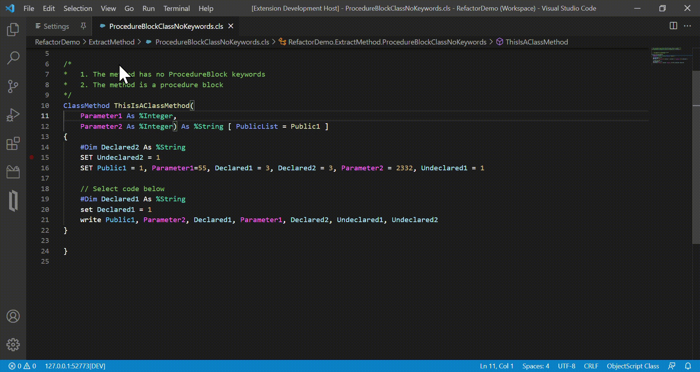
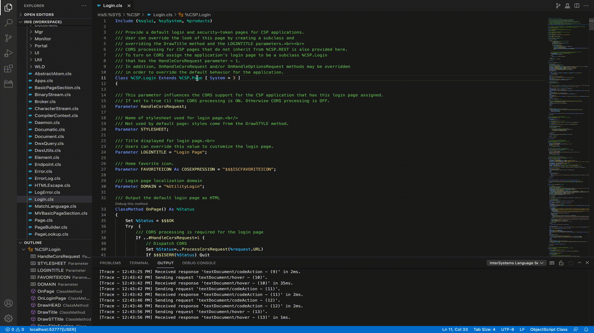

# InterSystems Language Server

This is a [LSP](https://microsoft.github.io/language-server-protocol/) compliant language server for [InterSystems](http://www.intersystems.com/our-products/) ObjectScript powered by Node.js and written primarily in TypeScript. It is maintained by InterSystems.

## Features

- [InterSystems Studio](https://docs.intersystems.com/irislatest/csp/docbook/Doc.View.cls?KEY=GSTD_Intro)-style semantic token coloring for InterSystems ObjectScript classes, routines and CSP files, with support for embedded languages like SQL, Python, Basic, MultiValue Basic, HTML, XML, Java, JavaScript and CSS.
- Hover information for ObjectScript commands, system functions, system variables, classes, class members, macros, preprocessor directives, UDL keywords and Parameter types, and embedded SQL tables, fields and class methods and queries invoked as SQL procedures.
- [Go to definition](https://code.visualstudio.com/docs/editor/editingevolved#_go-to-definition) for ObjectScript classes, class members, macros, routines, routine labels and embedded SQL tables, fields and class methods and queries invoked as SQL procedures.
- Code completion for ObjectScript classes, class members, system functions, system variables, macros, include files, package imports, preprocessor directives, UDL keywords, UDL keyword values and UDL Parameter types.
- Code completion for XML Element names, Attribute names and Attribute values within XData blocks that have the XMLNamespace keyword set to a URL that corresponds to a Studio Assist Schema (SASchema).
- Signature help for ObjectScript methods and macros that accept arguments.
- Document symbols for ObjectScript classes, routines and include files.
- Full document and range-based code formatting for the following:
  - Normalize the case of ObjectScript commands, system functions and system variables.
  - Normalize the usage of short or long versions of ObjectScript commands, system functions and system variables.
- Code linting for ObjectScript and UDL that checks for the following:
  - Syntax errors, including for embedded languages.
  - References to local variables that are undefined.
  - Classes and routines that don't exist in the database.
  - Invalid UDL Parameter types.
  - Mismatches between declared UDL Parameter types and the assigned value.
  - Classes, Methods, Parameters and Properties that are [Deprecated](https://docs.intersystems.com/irislatest/csp/docbook/Doc.View.cls?KEY=ROBJ_method_deprecated).
- [Folding Ranges](https://code.visualstudio.com/docs/editor/codebasics#_folding) for the following:
  - ObjectScript code blocks (If/ElseIf/Else, Try/Catch, For, While, etc.)
  - UDL class members
  - ObjectScript routine labels
  - UDL descriptions
  - ObjectScript documentation comments (/// in first column)
  - XML tags in XData blocks
  - Storage XML tags
  - JSON in XData blocks
  - %DynamicObject and %DynamicArray
  - ObjectScript preprocessor code blocks
  - Multi-line macro definitions
  - Dotted Do blocks
  - Embedded code blocks (SQL, HTML, JavaScript)
  - Region markers (`#;#region` or `//#region` to start and `#;#endregion` or `//#endregion` to end)
- [Symbol Renaming](https://code.visualstudio.com/docs/editor/refactoring#_rename-symbol) for ObjectScript local variables and method arguments within class definitions.
- [Go to type definition](https://code.visualstudio.com/docs/editor/editingevolved#_go-to-type-definition) for ObjectScript method arguments and variables declared with `#Dim`.
- Go to declaration for ObjectScript method arguments, variables declared with `#Dim` and variables in the [PublicList](https://docs.intersystems.com/irislatest/csp/docbook/Doc.View.cls?KEY=ROBJ_method_publiclist).
- Command to override inherited class members. To invoke the command, right-click in a blank line of a class definition body and select the `Override Class Members` row in the menu that appears. The command will insert the selected class member definition(s) at the cursor position where the command was invoked.
- [Evaluatable Expression Provider](https://code.visualstudio.com/api/references/vscode-api#EvaluatableExpressionProvider) that allows the debug hover to evaluate the following expressions side-effect free:
  - Globals
  - Class parameters
  - Method parameters
  - Private variables
  - Public variables
  - [System variables](https://docs.intersystems.com/irislatest/csp/docbook/Doc.View.cls?KEY=RCOS_VARIABLES)
- [Document Links](https://code.visualstudio.com/api/references/vscode-api#DocumentLink) for [CLASS, METHOD, PROPERTY and QUERY HTML tags](https://docs.intersystems.com/irislatest/csp/docbook/Doc.View.cls?KEY=GOBJ_classes#GOBJ_classdoc_html) in UDL documentation comments.
- [QuickFix CodeActions](https://code.visualstudio.com/docs/editor/refactoring#_code-actions-quick-fixes-and-refactorings) that resolve the following Diagnostics:
  - [Unqualified class references](https://docs.intersystems.com/irislatest/csp/docbook/Doc.View.cls?KEY=GOBJ_packages#GOBJ_packages_in_classname) in a class definition that don't exist in the database:
    - Select a package containing the unqualified class name to import.
  - Invalid UDL Parameter types and mismatches between declared UDL Parameter types and the assigned value:
    - Remove the invalid UDL Parameter type.
    - Select a correct UDL Parameter type to replace the invalid one.
- [Code refactoring CodeActions](https://code.visualstudio.com/docs/editor/refactoring#_code-actions-quick-fixes-and-refactorings) for the following:
  - Wrapping a block of ObjectScript code in a [Try/Catch block](https://docs.intersystems.com/irislatest/csp/docbook/DocBook.UI.Page.cls?KEY=ATRYCATCHFAQ).
  
  - Extracting a block of ObjectScript code from an existing method to a new method.
  
- [Type Hierarchy Provider](https://code.visualstudio.com/api/references/vscode-api#TypeHierarchyProvider) for ObjectScript classes to show subclasses and superclasses in a hierarchical tree view:


## Setup Notes

If the configured user "xxx" for connection to a server does NOT have the `%All` Role, execute the following query on the server to enable all of this extension's features.

```SQL
GRANT SELECT ON SCHEMA %Dictionary TO xxx
```

## Language Feature Configuration

This extension provides the following configuration parameters:

```json
"intersystems.language-server.trace.server": {
  "scope": "application",
  "type": "string",
  "enum": [
    "off",
    "messages",
    "verbose"
  ],
  "default": "off",
  "description": "Traces the communication between VS Code and the language server."
},
"intersystems.language-server.formatting.commands.case": {
  "scope": "application",
  "type": "string",
  "enum": [
    "upper",
    "lower",
    "word"
  ],
  "default": "word",
  "description": "Controls the case that ObjectScript commands will be changed to during a document formatting request."
},
"intersystems.language-server.formatting.commands.length": {
  "scope": "application",
  "type": "string",
  "enum": [
    "short",
    "long"
  ],
  "default": "long",
  "description": "Controls the length that ObjectScript commands will be changed to during a document formatting request."
},
"intersystems.language-server.formatting.system.case": {
  "scope": "application",
  "type": "string",
  "enum": [
    "upper",
    "lower",
    "word"
  ],
  "default": "upper",
  "description": "Controls the case that ObjectScript system functions and variables will be changed to during a document formatting request."
},
"intersystems.language-server.formatting.system.length": {
  "scope": "application",
  "type": "string",
  "enum": [
    "short",
    "long"
  ],
  "default": "long",
  "description": "Controls the length that ObjectScript system functions and variables will be changed to during a document formatting request."
},
"intersystems.language-server.hover.commands": {
  "scope": "application",
  "type": "boolean",
  "default": true,
  "description": "Controls whether hover information is provided for ObjectScript commands."
},
"intersystems.language-server.hover.system": {
  "scope": "application",
  "type": "boolean",
  "default": true,
  "description": "Controls whether hover information is provided for ObjectScript system functions and variables."
},
"intersystems.language-server.hover.preprocessor": {
  "scope": "application",
  "type": "boolean",
  "default": true,
  "description": "Controls whether hover information is provided for ObjectScript preprocessor directives."
},
"intersystems.language-server.diagnostics.routines": {
  "scope": "application",
  "type": "boolean",
  "default": false,
  "description": "Controls whether error diagnostics are provided when a routine or include file that is being referred to doesn't exist in the database."
},
"intersystems.language-server.diagnostics.parameters": {
  "scope": "application",
  "type": "boolean",
  "default": true,
  "description": "Controls whether warning diagnostics are provided when a class Parameter has an invalid type or the assigned value of the Parameter doesn't match the declared type."
},
"intersystems.language-server.diagnostics.classes": {
  "scope": "application",
  "type": "boolean",
  "default": true,
  "description": "Controls whether error diagnostics are provided when a class that is being referred to doesn't exist in the database."
},
"intersystems.language-server.diagnostics.deprecation": {
  "scope": "application",
  "type": "boolean",
  "default": true,
  "description": "Controls whether strikethrough warning diagnostics are provided when a class or class member that is being referred to is deprecated."
},
"intersystems.language-server.signaturehelp.documentation": {
  "scope": "application",
  "type": "boolean",
  "default": true,
  "description": "Controls whether documentation for a method is shown when a SignatureHelp is active. NOTE: This setting does not affect documentation for macro SignatureHelp views, which is always shown."
},
"intersystems.language-server.suggestTheme": {
  "scope": "application",
  "type": "boolean",
  "default": true,
  "description": "Controls whether the extension will suggest that one of the InterSystems default themes be used if neither one is active upon extension activation."
},
"intersystems.language-server.refactor.exceptionVariable": {
  "scope": "application",
  "type": "string",
  "default": "ex",
  "description": "The name of the exception variable inserted in a 'Wrap in Try/Catch' refactor."
}
```

Changes to these parameters can be made in the [Visual Studio Code user settings editor](https://code.visualstudio.com/docs/getstarted/settings#_edit-settings).

## Coloring Configuration

This extension is packaged with two [Web Content Accessibility Guidelines](https://www.w3.org/WAI/standards-guidelines/wcag/) (WCAG) 2.0 AAA compliant default themes (one light and one dark) maintained by InterSystems. They have been developed with usability and accessibility in mind and are recommened for all users. Users may also use any VSCode theme downloaded from the marketplace or included by default. While the coloring provided by those themes will be syntactically correct, not all themes provide support for advanced features, such as coloring method arguments differently than local variables. If you wish to customize the colors assigned to InterSystems semantic tokens, there are two approaches, which are detailed below.

### Semantic Token Definitions

This extension provides the following high-level semantic tokens for coloring similar features across all supported languages:

```json
"semanticTokenTypes": [
  {
    "id": "ISC_Error",
    "description": "InterSystems-wide error token."
  },
  {
    "id": "ISC_Comment",
    "description": "InterSystems-wide comment token."
  },
  {
    "id": "ISC_StringLiteral",
    "description": "InterSystems-wide string literal token."
  },
  {
    "id": "ISC_NumericLiteral",
    "description": "InterSystems-wide numeric literal token."
  },
  {
    "id": "ISC_ClassName",
    "description": "InterSystems-wide class and routine name token."
  },
  {
    "id": "ISC_DocComment",
    "description": "InterSystems-wide documentation comment token."
  },
  {
    "id": "ISC_Parameter",
    "description": "InterSystems-wide parameter token."
  },
  {
    "id": "ISC_System",
    "description": "InterSystems-wide system function and variable token."
  },
  {
    "id": "ISC_Command",
    "description": "InterSystems-wide command token."
  },
  {
    "id": "ISC_Keyword",
    "description": "InterSystems-wide keyword token."
  },
  {
    "id": "ISC_ClassMember",
    "description": "InterSystems-wide class member token."
  },
  {
    "id": "ISC_LocalVariable",
    "description": "InterSystems-wide locl variable token."
  },
  {
    "id": "ISC_LocalVariableUnset",
    "description": "InterSystems-wide unset local variable token."
  },
  {
    "id": "ISC_PublicVariable",
    "description": "InterSystems-wide public variable and global token."
  },
  {
    "id": "ISC_SQLKeyword",
    "description": "InterSystems-wide SQL keyword and datatype token."
  },
  {
    "id": "ISC_SQLFunction",
    "description": "InterSystems-wide SQL function token."
  },
  {
    "id": "ISC_Neutral",
    "description": "InterSystems-wide neutral token."
  },
  {
    "id": "ISC_Operator",
    "description": "InterSystems-wide operator token."
  },
  {
    "id": "ISC_Delimiter",
    "description": "InterSystems-wide delimiter token."
  },
  {
    "id": "ISC_MarkupText",
    "description": "InterSystems-wide markup text token."
  }
]
```

### Custom Styling Rules

To customize the colors for one or more of these semantic tokens, add the [editor.semanticTokenColorCustomizations code block](https://code.visualstudio.com/docs/getstarted/themes#_editor-semantic-highlighting) to your user or workspace [settings.json](https://code.visualstudio.com/docs/getstarted/settings#_settings-file-locations) file. For example:

```json
"editor.semanticTokenColorCustomizations": {
    "enabled": true, // enable for all themes, but see note below
    "rules": {
        "ISC_Error":{"foreground":"#F44747","fontStyle":"bold"}
    }
}
```

Note that setting `"enabled": false` in the object shown above does not merely disable the rules within the object. Instead it disables semantic token coloring in all themes and languages, unless you have also changed `"editor.semanticHighlighting.enabled"` from its default value of `"configuredByTheme"`.

### Custom Themes

To create your own custom color theme that provides coloring for InterSystems semantic tokens or modify your exisiting theme to do so, use the [semanticHighlighting and semanticTokenColors settings](https://code.visualstudio.com/api/language-extensions/semantic-highlight-guide#theming) in your theme definition json file. For example:

```json
"semanticHighlighting": true,
"semanticTokenColors": {
  "ISC_Error": {"foreground": "#ff8484", "bold": true},
  "ISC_Comment": "#80bd66",
  "ISC_StringLiteral": "#d4b57c",
  "ISC_NumericLiteral": "#d4b57c",
  "ISC_ClassName": "#4EC9B0",
  "ISC_ClassMember": "#DCDCAA",
  "ISC_DocComment": "#80bd66",
  "ISC_Parameter": "#ff75f4",
  "ISC_System": "#85a6ff",
  "ISC_Command": "#ffffff",
  "ISC_Keyword": "#85a6ff",
  "ISC_LocalVariable": "#ade2ff",
  "ISC_LocalVariableUnset": "#ade2ff",
  "ISC_PublicVariable": "#64c9ff",
  "ISC_SQLKeyword": "#ffffff",
  "ISC_SQLFunction": "#85a6ff",
  "ISC_Neutral": {"italic": true}
}
```

Any tokens that are not assigned a color by the custom theme will be assigned the default color (white for dark themes, black for light themes).

## Dependencies

This extension requires that the [vscode-objectscript](https://marketplace.visualstudio.com/items?itemName=intersystems-community.vscode-objectscript) extension be downloaded and enabled.

## Compatibility

All InterSystems products that include the Atelier APIs (Caché/Ensemble from 2016.2 onward, all versions of InterSystems IRIS) are supported.
